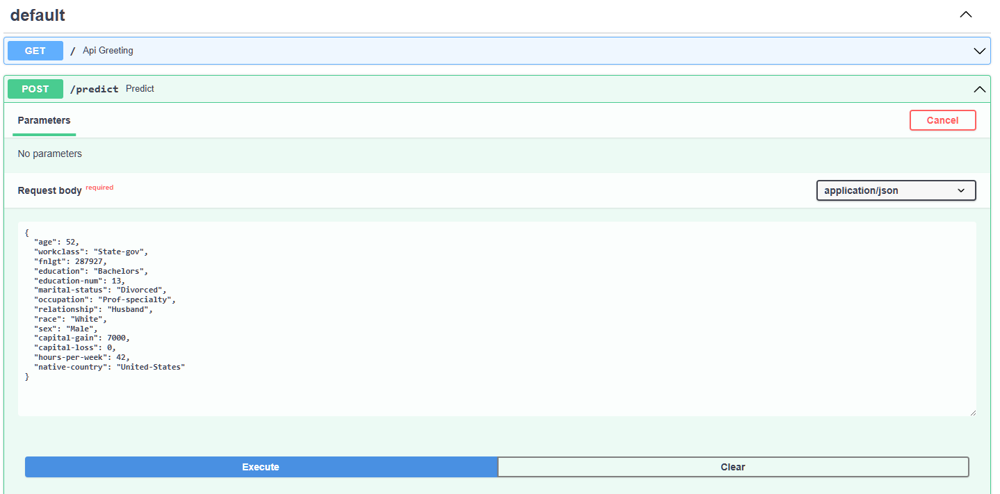

# Census Income Classification
Classification model on Census Bureau data.

## Project description

The purpose of this project is to deploy a scalable pipeline as would be done in a production environment. For that 
purpose we build an API using FastAPI and deploy it using Render. The API run machine learning inference, a prediction 
on the Census Income Data Set. Data and models are saved on AWS s3 and we use DVC to track them.

We use a multilayer perceptron (MLP) with Dropout for the task. The model is implemented using pytorch. We use the 
pytorch version restricted to CPU in order to reduce the size of our slug (app and its dependencies).
In the process of building this model and API we:
- check performance on slices
- write a model card
- track the models and data using DVC
- track the tests coverage using codecov
- use GitHub Actions and Render for CI/CD

The data used for training the models and performing the analysis must be saved in 
**data/census.csv**. The data currently used come from the [Census Bureau](https://archive.ics.uci.edu/ml/datasets/census+income).

### Processing the data for training
- Raw data from the Census Bureau are in **data/census.csv**
- Raw data are pre-processed in the notebook **Cleaning.ipynb** by removing white spaces and saved as **census_clean.csv**
- The raw data are split between training and testing (80%/20%)
- The data pre-processing tools are trained using only training data. The pipeline for pre-processing the data used by 
the model is as follows:
  - One hot encoding for categorical variables
  - StandardScaler for continuous variables
  - labelBinarizer for labels (target)
### Training the model
- The code related to training is found in **starter/ml/model.py**
- Hyper-parameter tuning is done using Optuna. We split training data between train and dev for that purpose (80%/20%)
The model trained use the following hyper-parameters(which can be found in **parameters/hyperparams.yml**):
  - number layers: 1
  - batch size: 64
  - dropout rate: 0.5
  - hidden dimension: 50
  - learning rate: 1.06031326045918e-05

### Test results
- The overall classification performance of the trained model on test data is:
  - precision: 0.7489
  - recall 0.6416
  - F1: 0.6911
- We also measure performance on slices of the data using the categorical feature 'education':


## Code organisation
- data used for training are found in **/data**
- Serialised trained model and preprocessing tools used in the inference pipeline are found in **/model** 
- features and hyper-parameters are in **/parameters**
- The code for processing the data, training the model and hyper-parameters search is in **/starter**
- Tests used for CI are in **starter/tests**. These tests include tests on the model, the code in general and the API
- The code for the API requests is in **main.py**
- **api_requests.py** is used to test if the API deployed works properly

## Data and Model Versioning
We use DVC to store and track both our data and models. We use AWS s3 for storage. The steps to follow for AWS and DVC 
set up are:
- In the CLI environment we install the [AWS CLI tool](https://docs.aws.amazon.com/cli/latest/userguide/cli-chap-install.html)
- To use our new S3 bucket from the AWS CLI we will need to create an IAM user with the appropriate permissions.
The full instructions can be found [here](https://docs.aws.amazon.com/IAM/latest/UserGuide/id_users_create.html#id_users_create_console).
- To save file and track it with dvc we follow steps as shown in the example below:
```bash
> dvc add model/mlp.pt
> git add model/mlp.pt.dvc .gitignore
> git commit -m "Initial commit of tracked mlp.pt"
> dvc push
> git push
```

## API Creation

- We create a RESTful API using FastAPI, using type hinting and a Pydantic model to ingest the body from POST. 
This implement:
  - GET on the root giving a welcome message
  - POST that does model inference
- Unit tests to test the API
- Once deployed on Render, we can get the API docs at the following url: [https://mlop3-census-income-classification-3.onrender.com/docs](https://mlop3-census-income-classification-3.onrender.com/docs).
An example of the data structure needed for the POST request can be found in the API docs:
Screenshot showing an example


## CI/CD
### CI
- We set up GitHub Actions on the repository. We use the pre-made GitHub Actions python-package-conda.yml and adapt it 
to the version of python used: 3.9. This action runs ```pytest``` and ```flake8``` on push and requires both to pass without error
- We add AWS credentials to the action (secrets need to be made available to the workflow by creating Repository Secret)
Connect AWS to GitHub actions:
  - We add our [AWS credentials to the Action](https://github.com/marketplace/actions/configure-aws-credentials-action-for-github-actions).
  - We make secrets available to our workflow by creating Repository Secrets: 
  [Creating encrypted secrets for a repository](https://docs.github.com/en/actions/security-guides/encrypted-secrets#creating-encrypted-secrets-for-a-repository).
- We set up [DVC in the action](https://github.com/iterative/setup-dvc) and specify a command to ```dvc pull```, 
we need to add it in the action steps defined in the action YAML file:
```bash
 - name: Download DVC artifacts
   run: dvc pull
```


### CD with Render
 We use Render to run our python application that consists in an API for machine learning inference.
 
- First we need to give Render the ability to pull in data from DVC upon app start up and set up access to AWS
 We set environment variable in the settings : AWS_ACCESS_KEY_ID =XX , $AWS_SECRET_ACCESS_KEY=XX , $AWS_REGION=XX

- We then define the Build command:
```pip install -r requirements.txt && dvc remote modify myremote access_key_id "$AWS_ACCESS_KEY_ID" && dvc remote modify myremote secret_access_key "$AWS_SECRET_ACCESS_KEY" && dvc remote modify myremote region "$AWS_REGION" && aws s3 ls s3://mlop3-census-data/files/md5/ && dvc pull --verbose```


- And the Start Command:
  ```uvicorn main:app --host=0.0.0.0 --port=$PORT```
  - This instruction allows our API to be launched using ```uvicorn```
  - We use the IP ```0.0.0.0``` to tell the server to listen on every open network interface 

- To be sure Render deploys with the proper python version we need to add a `runtime.txt` file at the root 
  of the directory
  
- Finally we set Auto-Deploy **On Commit** to assure Continuous deployment


  
## Using the API
- The get method of the app con be accessed at the following url: [https://mlop3-census-income-classification-3.onrender.com/](https://mlop3-census-income-classification-3.onrender.com/)
- The API can be used for prediction using the ```requests``` module. An example of how to use the API for inference can 
be found in **api_request.py**

Screenshot showing thee browser receiving the content of the GET implementes on the root domain


Screenshot showing the results of a script that POSTS to the API using the requests module and returns both the result of model inference and the status code.


